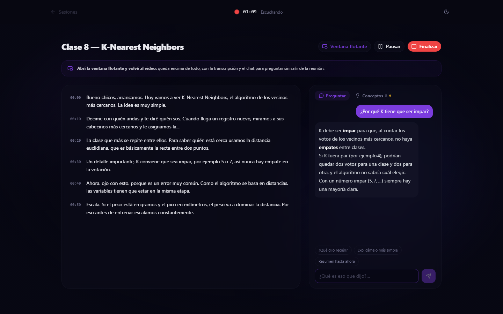
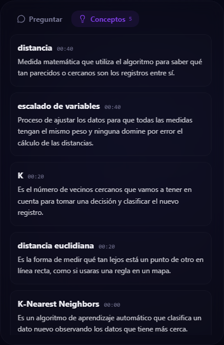
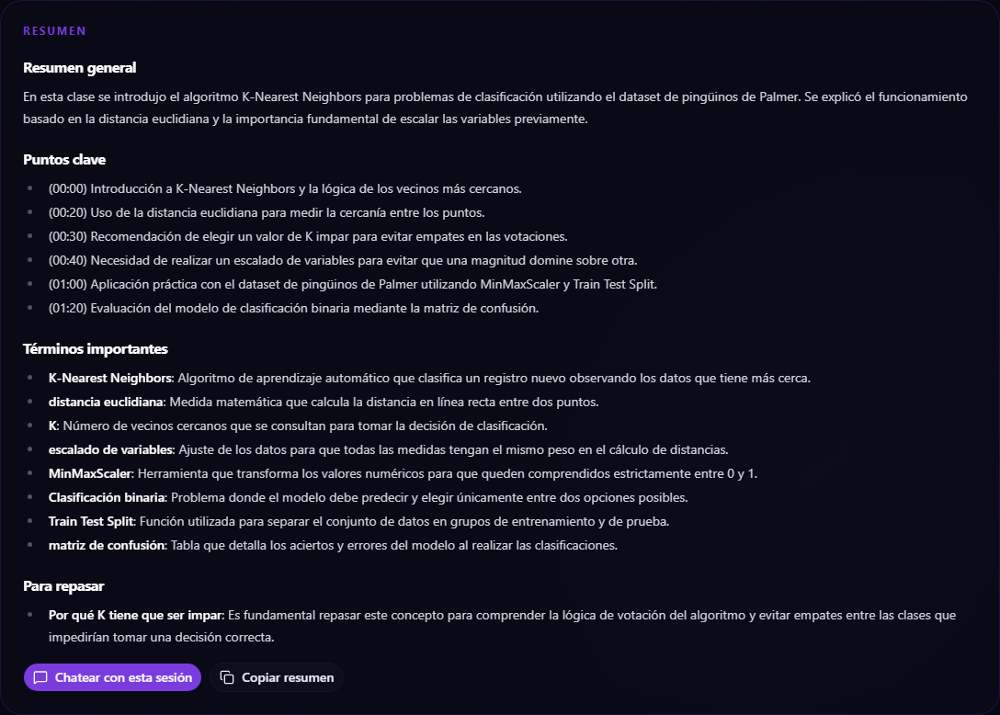
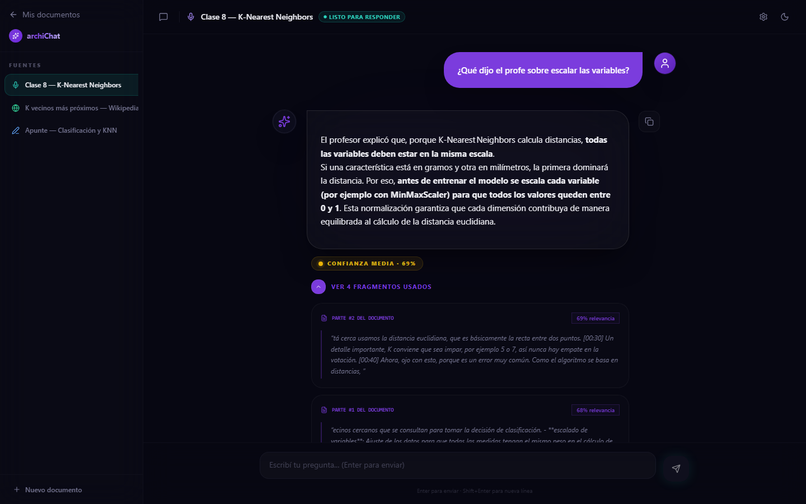
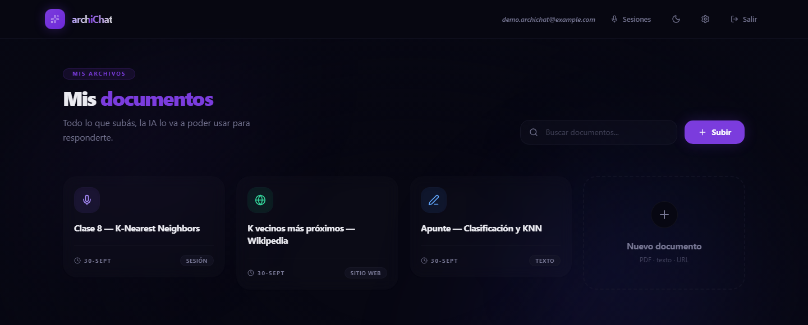
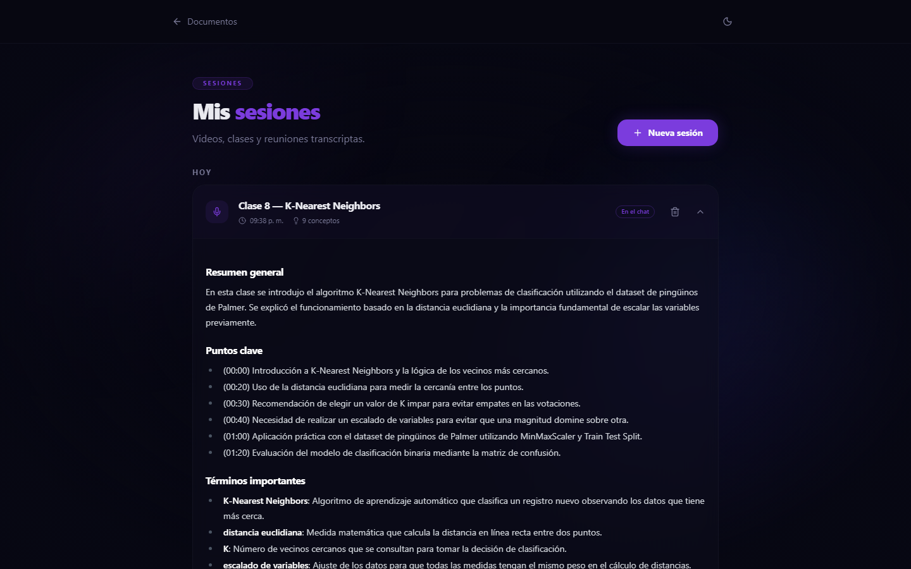

# archiChat

Chat con tus documentos y con lo que escuchás en vivo. Subís un PDF, un texto o una URL y le hacés preguntas en lenguaje natural: cada respuesta muestra de qué fragmento salió. Y con **Sessions**, mientras mirás un video, una clase o una reunión de Zoom o Meet, archiChat transcribe lo que se dice, explica solo los conceptos que van apareciendo y te deja preguntar sin salir de la pantalla. Al terminar, la sesión queda como un documento más para seguir chateando con ella.

**En producción:** https://archi-chat.vercel.app (se puede crear una cuenta; cada cuenta ve solo sus propios datos)

<p align="center">
  
</p>
<p align="center">
  
  
</p>
<p align="center">
  
</p>
<p align="center">
  
  
</p>
<p align="center"><sub>Capturas de la app en producción con una cuenta de demo. La "clase" es audio sintetizado y la transcripción está sin editar, tal como la devuelve Whisper.</sub></p>

## Funcionalidades

**Chat con documentos (RAG)**
- **PDF, texto o URL:** el contenido se divide en fragmentos, se convierte en embeddings y se guarda en Postgres con pgvector
- **Respuestas con fuentes:** cada respuesta muestra los fragmentos usados y un nivel de confianza
- **Búsqueda web** cuando la respuesta no está en el documento o se pide algo actual ("¿cuánto está el dólar hoy?"), ubicada en la fecha y el país del usuario
- **Memoria de la conversación:** entiende preguntas de seguimiento ("¿y el blue?")
- **Sugerencias de preguntas** al abrir un documento, y streaming token por token

**Sessions: transcripción en vivo**
- **Escucha una pestaña, la computadora o el micrófono:** un video de YouTube, Meet o Zoom web; la app de escritorio de Zoom o Teams; o una clase presencial. Opción de sumar el micrófono propio para que también quede lo que uno dice
- **Transcripción cada ~10 segundos** con su minuto
- **Conceptos automáticos:** cuando aparece un término técnico o una sigla, se explica solo, sin preguntar
- **Preguntas en vivo** sobre los últimos 10 minutos: "¿qué dijo recién?", "explicámelo más simple", "¿qué me perdí desde mi última pregunta?". Si el usuario plantea algo equivocado, lo corrige en vez de darle la razón
- **Ventana flotante** (Document Picture-in-Picture) que queda encima de todo, incluso de la app de Zoom, con la transcripción, el chat y los controles: no hace falta salir del video
- **Resumen al finalizar** con puntos clave por minuto, términos importantes y una sección "Para repasar" armada con las dudas que tuvo el usuario
- **La sesión se convierte en documento** y se abre con el chat normal, sola o junto al apunte de la materia
- **Historial** agrupado por fecha, con descarga en Markdown

## Stack

- **Frontend:** Next.js 14 (App Router) + TypeScript + Tailwind CSS + shadcn/ui
- **Backend:** API Routes de Next.js + Supabase (Postgres, pgvector, Auth, Row Level Security)
- **IA:** Groq (`gpt-oss-120b` / `gpt-oss-20b`, Whisper large v3 turbo) y Gemini (Flash-Lite, embeddings)
- **Deploy:** Vercel

Todo corre sobre los planes gratuitos de cada servicio.

## Por qué está hecho así

- **Ningún modelo es imprescindible.** Los nombres de los modelos viven en un solo archivo ([`lib/models.ts`](lib/models.ts)) y cada llamada tiene un respaldo en otro proveedor: chat `gpt-oss-120b → gpt-oss-20b → Gemini`, búsqueda web `Groq browser_search → Gemini con Google Search → aviso de que no se pudo buscar`. Nació de un problema real: Groq retiró Llama 3.3 y Compound y el chat dejó de responder; ahora un retiro así es un cambio de una línea y no se nota.
- **Cada tramo de audio es un archivo completo.** Con `MediaRecorder.start(timeslice)` solo el primer pedazo tiene el encabezado del webm y Whisper rechaza el resto; por eso cada 10 segundos se arranca un grabador nuevo antes de detener el anterior, sin huecos.
- **Los temporizadores corren en un Web Worker.** Durante una sesión la pestaña de archiChat queda oculta detrás del video, y Chrome frena sus `setInterval` (después de 5 minutos, a una vez por minuto): la primera prueba real se cortó en el minuto 5:20. Los workers no tienen ese freno.
- **Whisper también se equivoca, y se filtra.** Con silencio inventa frases de subtítulos ("Gracias por ver", "Amara.org") y a veces repite en bucle el contexto que se le pasa; esos casos se descartan (con tests). Un medidor de volumen evita mandar los tramos en silencio, y los conceptos detectados (bien escritos) se le pasan a Whisper como vocabulario para que escriba bien los términos del tema.
- **En vivo, sin RAG; después, con RAG.** Diez minutos de habla entran enteros en el prompt, así que las preguntas en vivo no necesitan búsqueda semántica y responden en un par de segundos. Al finalizar, la sesión pasa por el mismo pipeline que los PDFs, para poder buscar en clases de horas.
- **Los límites gratuitos se calcularon antes de programar.** Whisper factura un mínimo de 10 segundos por pedido: con tramos de 5 s la cuota alcanzaba para ~2,7 h por día; con 10 s, ~5,5 h por modelo. La detección de conceptos usa Gemini para no gastar la cuota de Groq que necesita el chat.
- **Cada usuario ve solo lo suyo, garantizado por la base.** Todas las tablas tienen RLS; las API Routes usan la sesión del usuario, así que una sesión ajena no se puede leer ni escribir aunque se conozca su id. Las API keys de los proveedores viven solo en el servidor.

## Correr el proyecto localmente

```bash
git clone https://github.com/Coddek/archiChat.git
cd archiChat
npm install
cp .env.example .env.local   # Supabase, Groq y Gemini (las tres tienen plan gratis)
npm run dev
```

La base se arma corriendo [`supabase/schema.sql`](supabase/schema.sql) y [`supabase/user_settings.sql`](supabase/user_settings.sql) en el SQL Editor de Supabase. Para capturar audio de una pestaña o de la computadora hace falta Chrome o Edge de escritorio; en Firefox, Safari y celulares Sessions funciona solo con el micrófono.

## Tests

```bash
npx vitest run
```

18 tests: el chunker, las validaciones con Zod y el filtro de alucinaciones de Whisper (silencios, frases de subtítulos, repeticiones y ecos del vocabulario).

## Estado del proyecto

Funcional de punta a punta y en producción; Sessions se probó con una clase real por Zoom y con videos de YouTube. Empezó como proyecto final de un curso de IA para desarrolladores ([PROCESO.md](PROCESO.md)) y el plan de Sessions, con cada decisión y los bugs encontrados, está en [`plan-archichat-sessions.md`](plan-archichat-sessions.md). Pendiente: probar Sessions en iPhone y mostrar cuánta cuota gratuita queda en el día.

## Licencia

MIT
